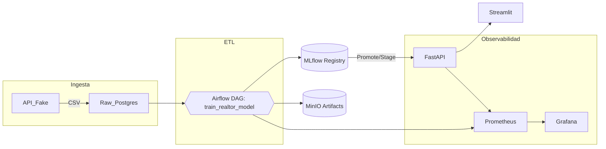

# Proyecto MLOps – Sistema End‑to‑End de Detección de Anomalías en Comercio Exterior

> **Objetivo**  
Desplegar un pipeline completo de *Data Ingestion → Entrenamiento → Deploy → Monitorización* para dos datasets (Exportaciones y Sustancias Controladas) usando **Autoencoders**, análisis **SHAP** y un **grafo heterogéneo** *empresa ↔ sub‑partida ↔ puerto*.  
El sistema funciona tanto en **Docker Compose (local)** como en **Kubernetes** gestionado por **Argo CD**.

---

## Tabla de Contenidos
1. [Arquitectura General](#arquitectura-general)
2. [Estructura de Directorios](#estructura-de-directorios)
3. [Puesta en Marcha Rápida](#puesta-en-marcha-rápida)
   * [Local – Docker Compose](#local--docker-compose)
   * [Clúster – Argo CD + Helm](#clúster--argo-cd--helm)
4. [CI / CD – GitHub Actions](#ci--cd--github-actions)
5. [Servicios Principales](#servicios-principales)
6. [Variables de Entorno](#variables-de-entorno)
7. [Endpoints y Ejemplos](#endpoints-y-ejemplos)
8. [Preguntas Frecuentes](#preguntas-frecuentes)
9. [Licencia](#licencia)

---

## Arquitectura General



---

## Estructura de Directorios

```text
.
├── api/                   # FastAPI de inferencia
├── ui/                    # Streamlit dashboard
├── dags/                  # DAGs de Airflow
├── ml/                    # Entrenamiento offline (autoencoder, SHAP)
├── locust/                # Test de carga
├── infra/
│   ├── prometheus.yml     # Scrape config (local)
│   └── argo-cd/           # ★ Integración Kubernetes + Argo CD
│       ├── argocd/        # Application manifest
│       └── apps/umbrella/ # Helm umbrella chart + sub‑charts
├── docker-compose.yml     # Stack local
└── .github/workflows/     # CI / CD
```

---

## Puesta en Marcha Rápida

### Local – Docker Compose

```bash
# 1. Construir y levantar servicios
docker compose up -d --build

# 2. Acceder
MLflow      → http://localhost:5000
Airflow     → http://localhost:8080  (user: airflow / pw: airflow)
FastAPI     → http://localhost:8000/docs
Streamlit   → http://localhost:8501
Grafana     → http://localhost:3000  (admin / admin)
```

### Clúster – Argo CD + Helm

1. **Instala Argo CD** (solo la primera vez):

   ```bash
   kubectl create namespace argocd
   helm repo add argo https://argo-cd-community.github.io/helm-charts
   helm upgrade --install argocd argo/argo-cd -n argocd          --set configs.params."server\.insecure"=true
   ```

2. **Aplica la Application** (una vez):

   ```bash
   kubectl apply -f infra/argo-cd/argocd/proyecto-mlops-app.yaml
   ```

3. **Observa la sincronización**:

   ```bash
   kubectl -n argocd get applications proyecto-mlops -w
   ```

4. **Secrets requeridos** (ejemplo para MinIO):

   ```bash
   kubectl -n mlops create secret generic mlops-minio          --from-literal=AWS_ACCESS_KEY_ID=minioadmin          --from-literal=AWS_SECRET_ACCESS_KEY=minioadmin
   ```

---

## CI / CD – GitHub Actions

* `build-images`  
  ‑ Compila imágenes de **FastAPI** y **Streamlit** → publica en **GHCR**.

* `bump-manifest`  
  ‑ Actualiza `.global.sha` en `values.yaml`, hace commit y abre PR.  
  ‑ Al fusionar, **Argo CD** despliega la nueva versión (automático).

---

## Servicios Principales

| Servicio | Descripción | Puerto (local) |
|----------|-------------|----------------|
| **FastAPI** | API de inferencia (sirve el último modelo en stage *Production*) | 8000 |
| **Streamlit UI** | Front interactivo para analistas | 8501 |
| **MLflow** | Seguimiento de experimentos + registry de modelos | 5000 |
| **Airflow** | Orquestación de ETL y entrenamiento | 8080 |
| **MinIO** | S3 compatible (artefactos de MLflow) | 9000 |
| **Postgres (raw)** | Almacén de datos crudos | 5432 |
| **Postgres (metadata)** | Features & metadatos | 5433 |
| **Prometheus** | Métricas | 9090 |
| **Grafana** | Dashboards | 3000 |

---

## Variables de Entorno

| Variable | Ejemplo (local) | Descripción |
|----------|-----------------|-------------|
| `MLFLOW_TRACKING_URI` | `http://mlflow:5000` | URL usada por FastAPI/Airflow |
| `MLFLOW_S3_ENDPOINT_URL` | `http://minio:9000` | End‑point S3 para artefactos |
| `AWS_ACCESS_KEY_ID` / `AWS_SECRET_ACCESS_KEY` | `minioadmin` | Credenciales MinIO |
| `POSTGRES_USER` / `POSTGRES_PASSWORD` | `mlops` | Usuarios para ambas bases |
| `MODEL_STAGE` | `Production` | Stage del modelo a servir |

---

## Endpoints y Ejemplos

* **Predicción simple (JSON)**  
  ```bash
  curl -X POST http://localhost:8000/predict         -H "Content-Type: application/json"         -d '{"empresa":"ABC","subpartida":"110100","puerto":"CARTAGENA"}'
  ```

* **Dashboard SHAP**  
  Abre `http://localhost:8501` y navega a la pestaña **Interpretabilidad**.

---

## Preguntas Frecuentes

**¿Dónde veo los modelos?**  
En MLflow → pestaña *Models*. Cuando el DAG `train_realtor_model` finaliza, promueve el mejor experimento a *Production*.

**¿Puedo escalar FastAPI?**  
En Kubernetes, ajusta `replicas` en `infra/argo-cd/apps/umbrella/charts/api/values.yaml`.

**¿Cómo añado un nuevo DAG?**  
Crea el archivo en `dags/` y asegúrate de que el GitSync de Airflow (ya configurado) lo recoja.

---

## Licencia

MIT © 2025 ‑ Grupo 4 – Maestría MLOps
